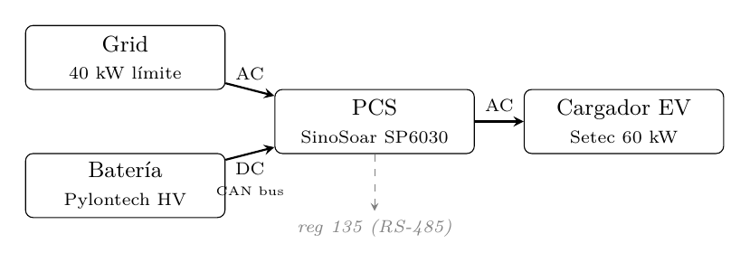
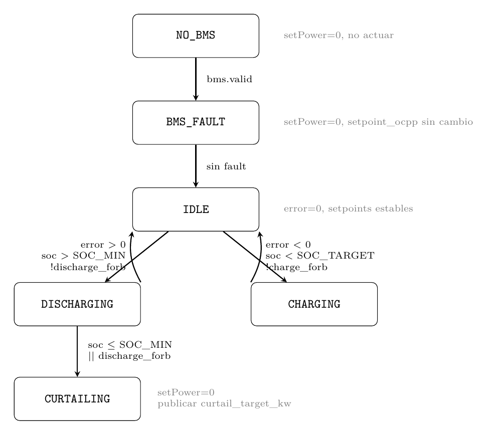

## 1. Descripción del sistema

**Topología:**



- Sin generación solar. Solo grid y batería.
- Única carga: cargador EV de hasta 60 kW.
- Objetivo: **peak shaving** — mantener `grid_p_kw ≤ GRID_LIMIT` (40 kW contractual) en todo momento.

---

## 2. Señales disponibles

| Variable | Fuente | Registro / Bus | Descripción |
|---|---|---|---|
| `grid_p_kw` | Modbus reg 192 | RS-485 | Potencia tomada de red (positivo = consumo) |
| `load_p_kw` | Modbus reg 200-213 | RS-485 | Potencia de carga EV |
| `bms.soc_pct` | CAN frame 0x421 | CAN 500kbps | SOC actual de la batería |
| `bms.max_discharge_a` · `bms.voltage_v` | CAN frame 0x422 | CAN 500kbps | Límite dinámico de descarga del BMS |
| `bms.max_charge_a` · `bms.voltage_v` | CAN frame 0x422 | CAN 500kbps | Límite dinámico de carga del BMS |
| `bms.charge_forbidden` | CAN frame 0x428 | CAN 500kbps | BMS prohíbe carga |
| `bms.discharge_forbidden` | CAN frame 0x428 | CAN 500kbps | BMS prohíbe descarga |

**Señal de control de salida:**

- `REG_SET_POWER` (reg 135): setpoint de potencia al PCS. Rango -100..+100 kW, precisión 0.1 kW. Positivo = descarga batería, negativo = carga batería.
- `ocpp_charging_profile`: límite de potencia al cargador EV vía API Setec / OCPP SetChargingProfile.

> **Incógnita pendiente:** confirmar si reg 135 es potencia AC (lado carga) o DC (lado batería). Resolver con prueba `test_set_power`.

---

## 3. Parámetros configurables (ThingsBoard shared attributes)

| Parámetro | Default | Descripción |
|---|---|---|
| `GRID_LIMIT_KW` | 40.0 | Techo contractual de potencia de red (kW) |
| `SOC_MIN` | 20.0 | SOC mínimo — no descargar por debajo (%) |
| `SOC_TARGET` | 90.0 | SOC objetivo para carga desde red (%) |
| `MAX_CHARGE_POWER_KW` | 10.0 | Potencia máxima de carga de batería desde red (kW) |
| `Ki_bat` | 0.1 | Ganancia control integral — batería (kW setpoint / kW error / s) |
| `Ki_ocpp` | 0.1 | Ganancia control integral — cargador EV (kW setpoint / kW error / s) |

---

## 4. Arquitectura de control

### 4.1 Separación de ciclos

El EMS opera en dos modos según si hay carga EV activa. La distinción no es lectura vs escritura sino **urgencia temporal** — el ciclo rápido necesita responder antes de que la térmica vea el pico, el ciclo lento gestiona dinámicas de minutos.

```
Modo STANDBY — ciclo cada 30s:
    leer bmsData (SOC, límites, faults)
    gestionar carga de batería desde red (write reg 135 si SOC < SOC_TARGET)
    watchdog CAN y Modbus — si timeout, forzar setpoint a 0
    leer shared attributes de ThingsBoard (GRID_LIMIT, Ki, SOC_TARGET, ...)
    publicar telemetría completa a ThingsBoard
    → transición a ACTIVE si load_p_kw > EV_THRESHOLD
      o si ocpp_status == CHARGING

Modo ACTIVE — ciclo cada 1s:
    leer grid_p_kw directamente de reg 192
    leer bmsData (actualizado por CAN)
    control integral: calcular setpoint_bat y setpoint_ocpp
    escribir reg 135
    enviar ocpp_charging_profile si cambió
    → transición a STANDBY si load_p_kw < EV_THRESHOLD
      por N ciclos consecutivos (anti-bounce)
      + escribir reg 135 = 0 al salir
```

**Nota sobre transiciones:** con OCPP disponible, `StatusNotification = Preparing` activa ACTIVE antes de que arranque la carga — feedforward. Sin OCPP, la detección es reactiva por umbral en `load_p_kw`, con latencia de hasta 30s desde el último ciclo STANDBY. En ese caso conviene reducir el ciclo STANDBY a 5s cuando el SOC está alto y la batería está lista para descargar.

El EMS **no lee del JsonDocument de telemetría** para sus decisiones — usa registros Modbus frescos propios.

**Estrategia de telemetría ThingsBoard:**

Telemetría periódica — cada 15s en ACTIVE, cada 30s en STANDBY:
`ems_state`, `soc_pct`, `grid_p_kw` (promedio del período), `setpoint_bat_kw`, `setpoint_ocpp_kw`, `load_p_kw`

Eventos inmediatos cuando ocurren: cambio de estado EMS, fault BMS, pérdida de comunicación CAN/Modbus, curtailment activo, cambio de parámetro vía shared attribute.

Estimado ~183K mensajes/mes — dentro del plan Pilot de ThingsBoard Cloud.

### 4.2 Control integral con saturación

El setpoint se actualiza en incrementos proporcionales al error — **control integral** puro. La planta es estática (mandás un setpoint, el PCS entrega esa potencia), por lo que el lazo cerrado es de **primer orden** con constante de tiempo:

$$\tau = \frac{1}{K_i}$$

Con `Ki = 0.1`, $\tau$ = 10 s. El sistema alcanza el **95% del valor final en $3\tau$ = 30 s** ante un escalón de demanda.

**Ley de control (corrida cada 1 segundo):**

```
error = grid_p_kw - GRID_LIMIT_KW

setpoint_bat_nuevo  = setpoint_bat  + Ki_bat  * error
setpoint_ocpp_nuevo = setpoint_ocpp + Ki_ocpp * error
```

**Saturaciones simétricas:**

```
bat_upper =  min(bms_max_discharge_kw, EMS_MAX_DISCHARGE_KW)
bat_lower = -min(MAX_CHARGE_POWER_KW,  bms_max_charge_kw)   // negativo = carga desde red

setpoint_bat  = clamp(setpoint_bat_nuevo,  lower = bat_lower, upper = bat_upper)
setpoint_ocpp = clamp(setpoint_ocpp_nuevo, lower = 0,         upper = 60.0)
```

Ambos límites del BMS son **dinámicos** — reportados en tiempo real via CAN:

```
bms_max_discharge_kw = bms.max_discharge_a * bms.voltage_v / 1000.0
bms_max_charge_kw    = bms.max_charge_a    * bms.voltage_v / 1000.0
```

**Anti-windup condicional:** solo actualizar setpoint si el error va en dirección que puede salir de la saturación:

```
en_sat_inf = (setpoint_bat <= bat_lower)
en_sat_sup = (setpoint_bat >= bat_upper)

if (!en_sat_inf || error > 0) && (!en_sat_sup || error < 0):
    setpoint_bat = clamp(setpoint_bat + Ki_bat * error, bat_lower, bat_upper)
```

**Carga de batería cuando hay margen:** el controlador lo logra naturalmente — error negativo empuja setpoint hacia `bat_lower`. La saturación garantiza que nunca cargue más de `MAX_CHARGE_POWER_KW`.

### 4.3 Alternativa: control integral no lineal para protección de térmica

Si el PCS tiene dinámica interna lenta ($\tau_{pcs}$ grande), dos integradores en cascada pueden oscilar. En ese caso usar:

$$u(e) = k \cdot e \cdot |e|$$

Ganancia efectiva `K_ef = k · |e|` — pequeña cerca del equilibrio (suave, sin overshooting), grande ante errores grandes (respuesta agresiva en transitorio). Se detecta en `test_set_power`: si `dc_power_kw` muestra overshooting ante un escalón de setpoint, hay dinámica interna y `Ki` debe reducirse.

> **Pendiente:** simular ODE discreta para comparar pico de `grid_p_kw` durante el transitorio en ambos controladores antes de decidir.

### 4.4 Comportamiento en régimen estacionario

Cuando `grid_p_kw = GRID_LIMIT_KW`, el error es cero y los setpoints no cambian. Cuando la carga EV termina, el error se vuelve negativo y `setpoint_bat` baja gradualmente hasta `bat_lower` — la batería carga desde red a potencia limitada por `MAX_CHARGE_POWER_KW` y `bms_max_charge_kw`. No se necesita lógica especial: la saturación simétrica lo maneja naturalmente.

---

## 5. Máquina de estados



**Nota sobre CURTAILING:** el EMS no intenta limitar la carga del EV directamente. Publica `curtail_target_kw` como telemetría en ThingsBoard para que la rule chain lo propague vía OCPP. El EMS no asume que el cargador obedecerá.

---

## 6. Modos de operación según disponibilidad de API Setec

### Modo A — API operativa (SetChargingProfile disponible)

Control coordinado de dos lazos integrales sobre el mismo error:

```
error = grid_p_kw - GRID_LIMIT_KW

Lazo batería:  setpoint_bat  += Ki_bat  * error  (saturado por BMS)
Lazo OCPP:     setpoint_ocpp += Ki_ocpp * error  (saturado a 60 kW)
```

Ambos lazos rampeando juntos eliminan el pico transitorio: el cargador nunca pide más de lo que grid + batería pueden dar.

### Modo B — API no disponible o solo lectura

Solo lazo de batería activo. El `setpoint_ocpp` queda fijo en 60 kW (máximo del cargador). Hay un pico transitorio inevitable al arranque del EV mientras el controlador rampa el setpoint de batería.

Aceptable si la medición tarifaria es en ventanas de 15 minutos (típico en Uruguay) — un transitorio de ~30 segundos no impacta la factura.

> **Pendiente:** confirmar modalidad de medición de demanda máxima con la distribuidora.

---

## 7. OCPP — lo relevante para este sistema

### Comando clave: SetChargingProfile

Permite fijar la potencia máxima del cargador dinámicamente. Es el `setpoint_ocpp` del controlador. El tipo correcto es **TxProfile** — aplica a la transacción activa y se descarta al terminar.

### Flujo de autorización

El EMS participa como validador externo en cada sesión de carga. El flujo pasa por ThingsBoard como intermediario — el EMS nunca habla OCPP directamente, consume la API REST de Setec.

```
EV conecta
    → Setec CSMS recibe Authorize
    → Setec consulta webhook ThingsBoard
        → rule chain extrae SOC, bat_disponible_kw del EMS
        → calcula maxChargingRate:
              SOC alto:  min(60, 40 + bat_disponible_kw)
              SOC bajo:  40 kW
        → responde Accepted + SetChargingProfile a Setec
        → Setec responde al cargador

EV cargando
    → controlador integral ajusta setpoint_bat y setpoint_ocpp cada 1s
    → ThingsBoard propaga setpoint_ocpp a Setec API → SetChargingProfile dinámico
```

Esto cierra el agujero de SOC bajo + evento no recibido: la autorización siempre ocurre antes de que el EV tire potencia, y el `maxChargingRate` inicial ya refleja el estado real de la batería.

**Fallback si ThingsBoard está caído:** negociar con Setec que ante timeout del validador externo el default sea `Accepted` con `maxChargingRate = 40 kW`. Sin riesgo tarifario, sin bloquear la carga.

**Lectura relevante:**
- **StatusNotification** — `Preparing` es la señal de anticipación para pre-activar la batería antes del arranque (Modo A).
- **MeterValues** — potencia activa periódica del cargador. Alternativa a `load_p_kw` del Modbus con posiblemente mejor resolución temporal.

### Preguntas a confirmar con la API Setec

| Pregunta | Impacto |
|---|---|
| ¿Versión OCPP? ¿Expone SetChargingProfile directo? | Determina si Modo A es viable |
| ¿Heartbeat / latencia de comandos? | Frecuencia máxima del lazo OCPP |
| ¿MeterValues configurables a 1s? | Si se puede usar como señal de control |
| ¿StatusNotification en tiempo real? | Viabilidad del feedforward por `Preparing` |
| ¿Permite participar como validador externo en autorización? | Cierra agujero SOC bajo + evento no recibido |
| ¿Callback síncrono? ¿Timeout? | Viabilidad del round trip ESP32 → TB → Setec |
| ¿Negociable default 40 kW ante timeout? | Define fallback cuando TB está caído |

---

## 8. Incógnitas pendientes de resolver

| # | Incógnita | Cómo resolverla | Impacto en diseño |
|---|---|---|---|
| 1 | ¿Reg 135 es potencia AC o DC? | Prueba `test_set_power` con carga conocida | Escala del setpoint, compensación de eficiencia |
| 2 | ¿PCS clampea silenciosamente si setpoint > capacidad? | Prueba con batería a SOC bajo | Determina si saturación del EMS es suficiente |
| 3 | ¿Qué tan ruidoso es reg 192 en estacionario? | Monitoreo con `test_set_power` sin cambios | Define si se necesita filtro sobre `grid_p_kw` antes de calcular el error |
| 4 | ¿Latencia y capacidad de la API Setec? | Acceso a API + documentación | Determina si Modo A es viable y con qué frecuencia de actualización |
| 5 | ¿Modalidad de medición tarifaria (ventana 15 min)? | Consulta con distribuidora | Urgencia de eliminar transitorios |
| 6 | ¿Rampa interna del PCS al cambiar reg 135? | Prueba `test_set_power` con escalón a 1 kW | Planta estática (Caso 1) o primer orden (Caso 2) |
| 7 | ¿Cuál es $\tau_{pcs}$? | Prueba con carga pesada (20-30 kW), medir curva de `dc_power_kw` | Si grande, reducir $K_i$ o usar controlador no lineal |

---

## 9. Lo que NO cambia entre escenarios

Independientemente de las incógnitas anteriores, estos elementos del diseño están definidos:

- Modo ACTIVE (ciclo 1s) activado por evento OCPP o umbral en `load_p_kw`; modo STANDBY (ciclo 30s) para gestión de batería y telemetría
- Control integral con $K_i = 0.1$ ($\tau$ = 10 s, 95% en 30 s) como default, configurable vía shared attribute
- Saturación dinámica por límites del BMS en tiempo real
- Protecciones BMS con prioridad máxima sobre cualquier setpoint
- EMS lee `grid_p_kw` directamente de reg 192, no del JsonDocument de telemetría
- Estado del EMS publicado a ThingsBoard cada 15s en ACTIVE, cada 30s en STANDBY: `ems_state`, `setpoint_bat_kw`, `setpoint_ocpp_kw`, `curtail_target_kw`
